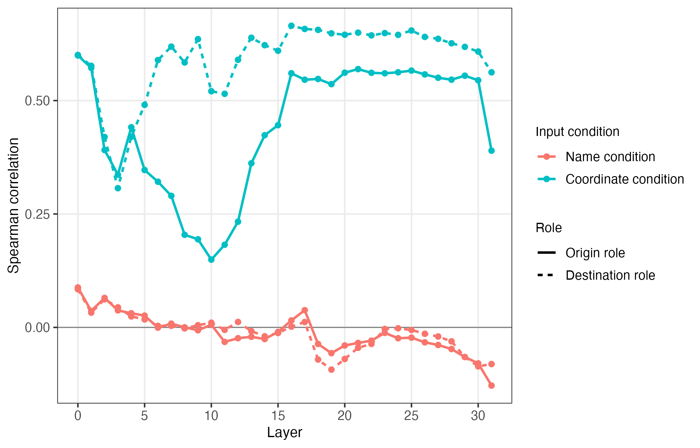

# Selected results

## Output-level reproduction

Across district and neighborhood scales, the frozen LLM-representation conditions did not consistently outperform baselines that explicitly encoded temporal regularity, OD marginals, or distance decay. The log-linear gravity baseline produced the lowest district-level MAE, RMSE, and sMAPE and the strongest district-level spatial-pattern reproduction.

The complete aggregate metric table used to prepare thesis Tables 4-1 and 4-2 is available at [`docs/results/output_metrics.csv`](results/output_metrics.csv).

## Principle-prompt comparison

Adding general spatial-interaction principles produced mixed district-level changes. The name condition improved in several error and origin-marginal metrics, while the coordinate condition improved in MAE, sMAPE, distance-decay difference, and origin-marginal correlation but worsened in other metrics. These comparisons do not isolate a causal prompt effect because input length and structure changed with the added principles.

The verified aggregate changes are in [`docs/results/principle_prompt_metric_changes.csv`](results/principle_prompt_metric_changes.csv).

## Internal representations

### Distance information

Both input conditions rose above the 0.2 chance benchmark in later layers. The coordinate condition showed substantially stronger distance-bin detectability, reaching its highest accuracy in the final layer.

### Origin-destination role conditioning

Representations of the same area diverged when that area appeared as an origin rather than a destination, particularly in middle layers.

### Flow association

Associations with total outflow and inflow varied across layers and roles and were not uniformly stable.

### Geographic alignment

Coordinate-based representations showed much stronger alignment with physical distance structure than name-based representations. This internal signal did not, by itself, produce accurate output-level mobility-flow reproduction.

## Data structure

Neighborhood-scale data were substantially sparser than district-scale data. Consequently, differences between scales should not be interpreted as the isolated effect of spatial resolution. The repository does not redistribute the Korean-language thesis figure for this descriptive comparison.
